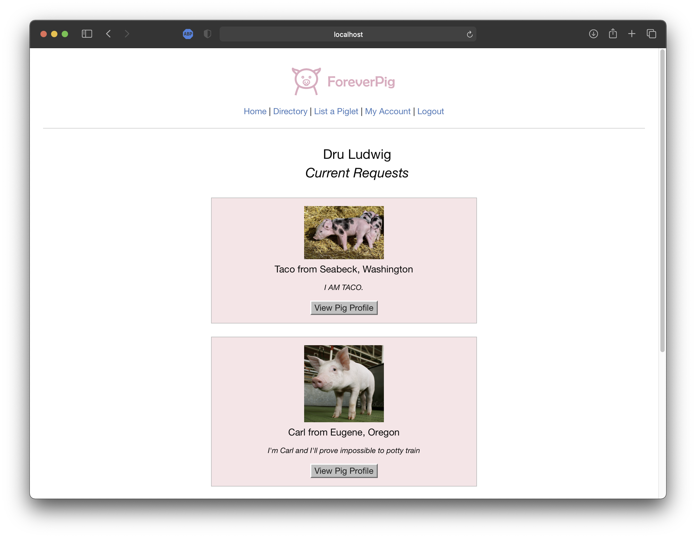

 
<i>Your Perpetual Piglet Provider</i>

  Live demo: <a href="https://dashboard.heroku.com/apps/forever-pig">https://dashboard.heroku.com/apps/forever-pig</a> 

  

  

  ## Description
  This was a team project inspired by an instructor's significant other's original idea. We were challenged to build the foundation for a fictitious <i>short-term piglet fostering service</i>. The project required understanding and implementation of [MySQL2](https://www.npmjs.com/package/mysql2), [Sequelize](https://www.npmjs.com/package/sequelize), [Passport](https://www.npmjs.com/package/passport), [Handlebars](https://www.npmjs.com/package/handlebars), and [Express](https://www.npmjs.com/package/express). 

## Usage
  This project is the first step in developing ForeverPig, and uses a simple workflow in its first iteration.
  1. User creates an account
  2. User browses a directory and requests a piglet of choice
  3. User views pending requests on their account

## Future versions
  The team discussed many feature additions for future versions including:
  - Allowing farmers(suppliers) to list their own animals
  - Adding a "Withdraw Request" button
  - Adding user/supplier social media style pages

## Contribution
  This was a team effort that included contributions from users:
  - [Leone Soth](https://github.com/lsoth)
  - [Zach Maurer](https://github.com/zmaurer1)
  - [Dru Ludwig](https://github.com/druludwig/)
  - [Jared Rose](https://github.com/MagnetMoss)

  ## License
  Use of this project is subject to the terms and conditions of the <a href="https://www.mit.edu/~amini/LICENSE.md">MIT License</a>.
  
  ## Screenshots

  
 
